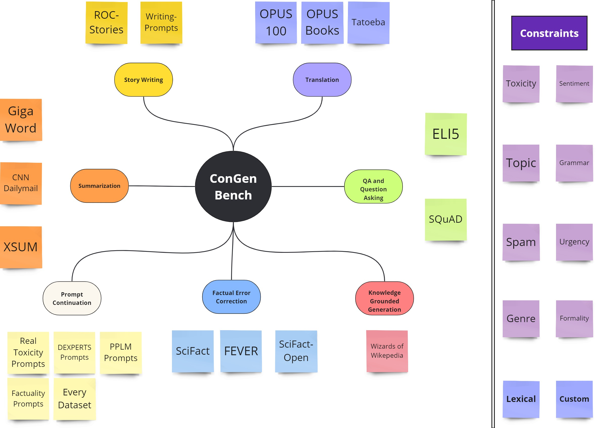

# ConGenBench
Research on Controllable Text Generation has made significant progress over the past few years. This repository is an attempt to create a one-stop shop for researchers who want to benchmark their method on various tasks in Controllable Text Generation. This includes:
1. Compilation of over 15 different generation tasks
2. Compilation of over 10 different constraint functions/datasets for the training of constraint satisfaction classifiers
4. A prompt-based LLM distillation method that produces a constraint satisfaction classifier for any natural language constraint
5. Implementations of 5 different baselines

## Supported Task and Constraint Datasets

## Constraints
Constraint Datasets
1. Toxicity (Jigsaw Toxicity Classification Challenge)
2. Sentiment (Yelp Polarity, SST2, SST5, IMDB Reviews)
3. Topic (AGNews)
4. Genre (StoryControl, TagMyBook)
5. Clickbait (Clickbait News Detection, Stop Clickbait)
6. Formality (Pavlick, GYAC must be downloaded from source)
7. Spam (Spamassassin, SMS Spam)
8. Urgency (Derived from CrisisNLP)
Constraint Functions
1. Numerical Structure Constraints (word/sentence/POS counts and ranges)

## Implemented Baselines
1. Score-based reranking
2. Prompt Tuning
3. ZeroShot Prompting
4. FewShot Prompting
5. LoRA

## Available evaluation metrics
1. Perspective API for Toxicity
2. External classifier (using classifiers trained on held-out constraint datasets)
3. ZeroShot / FewShot Prompt evaluation
4. LM Objective/ Perplexity
5. ROGUE
6. BLEU
